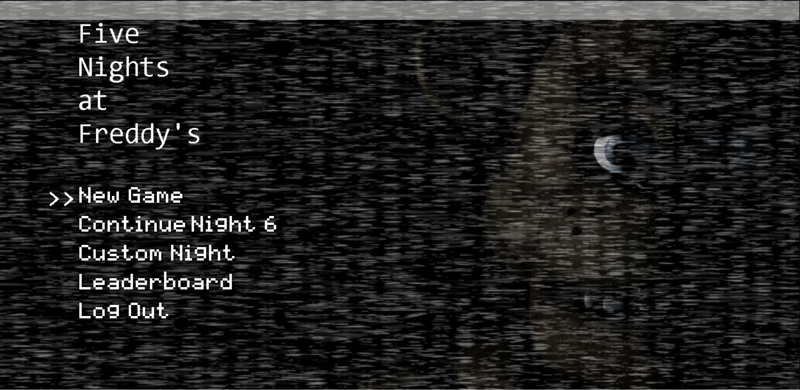
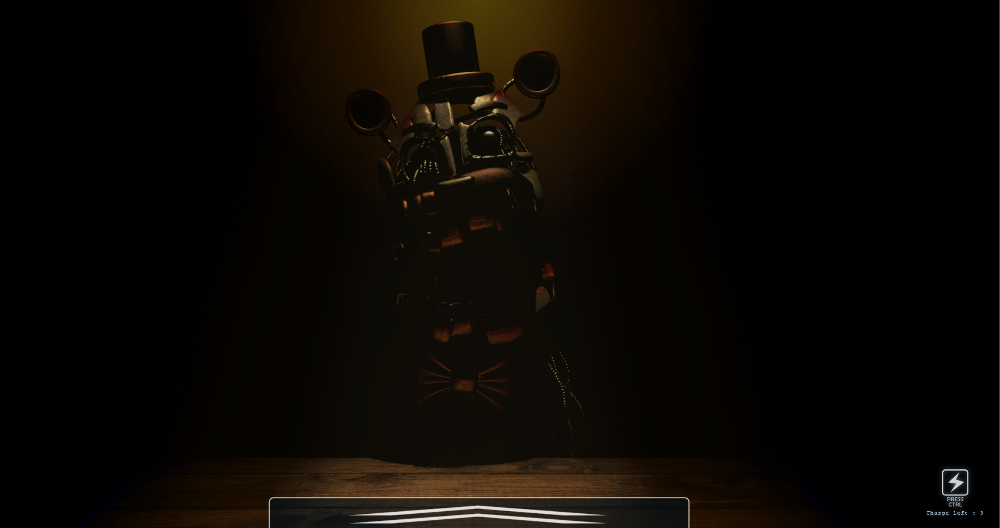
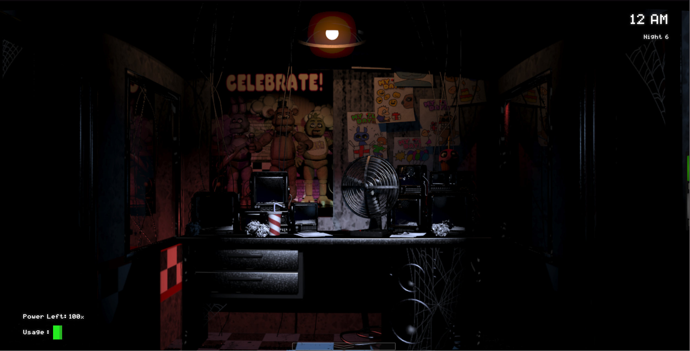
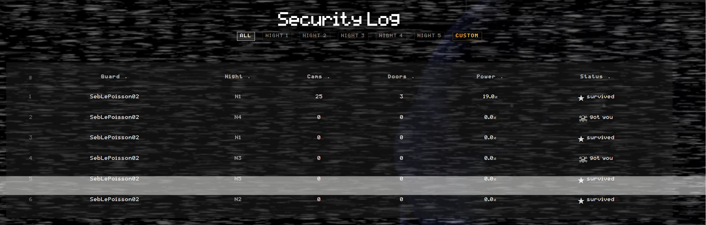
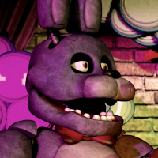
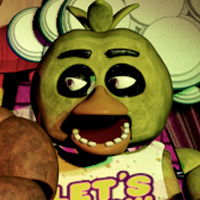
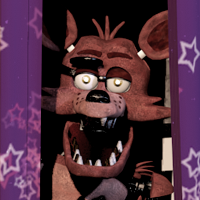
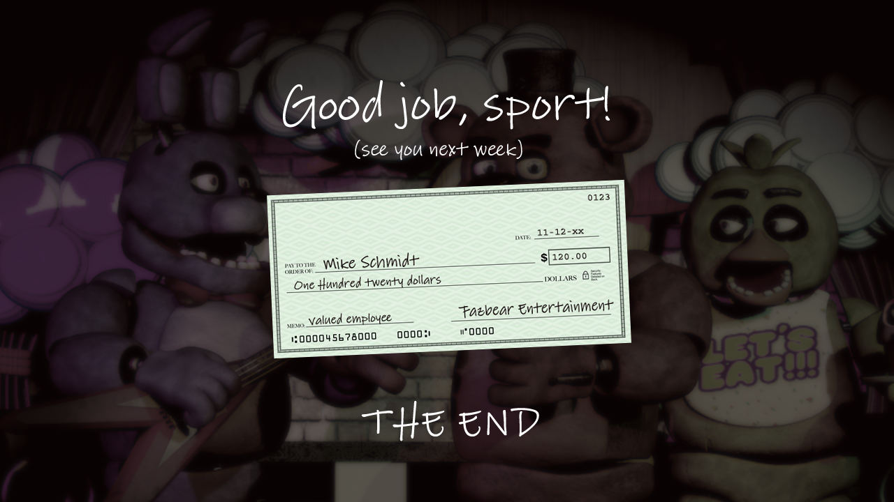

<div align="center">


# Five Nights at Freddy's : Full-Stack Web Edition

*"Hello? Hello, hello? Uh, I wanted to record a message for you to help you get settled in on your first night..."*

</div>

---

A full-stack web recreation of Five Nights at Freddy's 1. The game runs entirely in the browser; the backend handles authentication, a live leaderboard, and email-based password reset.

## Screenshots

<div align="center">

| Main Menu                             | Account Creation Mini-Game              |
|---------------------------------------|-----------------------------------------|
|  |    |
| Office                                | Leaderboard                             |
|     |  |


</div>

---

## Stack

| Layer | Tech |
|---|---|
| Game engine | Vanilla JS + HTML5 Canvas |
| Frontend SPA | React 18 · React Router v6 · Vite |
| API | Apollo GraphQL (`@apollo/server` + `expressMiddleware`) |
| Auth | Passport.js · JWT stored as HttpOnly cookie |
| Database | MongoDB + Mongoose |
| Email | Resend SDK |
| External APIs | ip-api.com (geolocation) · purgomalum.com (profanity filter) |
| Tests | Vitest · Supertest · Testing Library |

---

## Features

**Game**
- Nights 1–6 plus a fully configurable Custom Night
- All four animatronics with faithful AI movement and aggression scaling
- Power system, door/light controls, tablet camera with full minimap
- Golden Freddy easter egg and complete jumpscare sequences
- Per-session stat tracking: camera flicks, door closes, power remaining at 6 AM

**Auth & accounts**
- Register / login / logout with HttpOnly cookie JWT
- Username profanity check on registration (purgomalum.com)
- Forgot password → email link via Resend → reset form

**Leaderboard**
- Stores outcome, night, survival time, country flag (from IP geolocation), and in-game stats per run
- Filterable by night (N1–N6) and Custom Night; sortable columns
- React `/leaderboard` route uses Apollo `useQuery` with 10-second polling
- Standalone in-game `Leaderboard.html` with FNAF styling and the same data

---

## Animatronics

<div align="center">

| <br>**Freddy Fazbear** | <br>**Bonnie** | <br>**Chica** | <br>**Foxy** |
|---|---|---|---|
| Show Stage | Show Stage | Show Stage | Pirate's Cove |
| Stage → Dining → Restrooms → Kitchen → East Hall → Corner | Stage → Backstage → West Hall → Corner | Stage → Dining → Restrooms → East Hall → Corner | Cove (4 stages) → sprint West Hall |
| **Right door** | **Left door** | **Right door** | **Left door** |

</div>

AI levels scale with night number and hour. Custom Night lets you set each animatronic's level (0–20) manually.

---

## Project structure

```
.
├── index.html                  — React SPA entry
├── vite.config.js
├── vitest.config.js
├── server/
│   └── src/
│       ├── index.js            — MongoDB connect + listen
│       ├── app.js              — Express + Apollo setup (exported for tests)
│       ├── auth/               — Passport strategy, JWT helpers
│       ├── routes/auth.js      — REST: register, login, logout, forgot/reset password
│       ├── models/             — User.js · Score.js
│       ├── graphql/            — typeDefs · resolvers · context
│       └── tests/              — unit + integration tests
├── src/
│   ├── react/                  — SPA (login, register, leaderboard, play...)
│   │   ├── App.jsx
│   │   ├── pages/
│   │   ├── components/
│   │   ├── auth/
│   │   ├── lib/apollo.js
│   │   └── __tests__/
│   ├── pages/                  — Standalone game HTML pages
│   │   ├── Warning.html
│   │   ├── Menu.html
│   │   ├── MainRoom.html
│   │   ├── CustomNight.html
│   │   └── Leaderboard.html
│   └── engine/                 — Game logic (vanilla JS)
│       ├── gameState.js        — Time, power, stat tracking, score submission
│       ├── animatronics/       — AI for each character
│       └── ...
└── assets/                     — Sprites, audio, fonts
```

---

## Getting started

### Prerequisites

- Node.js >= 18
- MongoDB running locally (`mongodb://localhost:27017/fnaf`)
- A [Resend](https://resend.com) API key with a verified sending domain

### Setup

```bash
git clone https://github.com/Sebastian0211-vs/FiveNightsAtFreddyFullStackWeb.git
cd FiveNightsAtFreddyFullStackWeb
npm install
```

Create a `.env` file in the project root:

```env
# Backend
PORT=3002
MONGO_URI=mongodb://localhost:27017/fnaf
JWT_SECRET=<random 64-char hex>
CORS_ORIGIN=http://localhost:5173
NODE_ENV=development

# Email
RESEND_API_KEY=re_...
FRONTEND_URL=http://localhost:5173

# Frontend (Vite)
VITE_API_URL=http://localhost:3002
VITE_GRAPHQL_URL=http://localhost:3002/graphql
```

### Run

```bash
# Terminal 1 — backend
npm run dev:server

# Terminal 2 — frontend
npm run dev
```

Open `http://localhost:5173`. Register an account, then navigate to `/play` to start your shift.

### Test

```bash
npm test
```

5 test files · 12 tests · no live database or network required (MongoDB and Resend are mocked).

### Build

```bash
npm run build
```

---

## GraphQL API

**Queries**
```graphql
me: User
leaderboard(night: Int, limit: Int): [Score!]!
myScores: [Score!]!
```

**Mutations**
```graphql
updateProgress(night: Int!): User!
resetProgress: User!
submitScore(
  night: Int!, survivedSeconds: Int!, outcome: Outcome!,
  cameraFlicks: Int, doorCloses: Int, powerRemaining: Float,
  isCustomNight: Boolean,
  aiFreddy: Int, aiBonnie: Int, aiChica: Int, aiFoxy: Int
): Score!
```

All mutations require an authenticated session cookie. `submitScore` is called automatically by the game engine at the end of each night.

---

## Game controls

| Action | Input |
|---|---|
| Look left / right | Click and drag the scene |
| Toggle door | Upper half of door button |
| Toggle hallway light | Lower half of door button |
| Open / close tablet | Move mouse to bottom edge |
| Select camera | Click a room tile on the minimap |

> Headphones recommended. Designed for a 16:9 viewport.

---

<div align="center">



*Fan-made recreation. All original assets, audio, and characters belong to Scott Cawthon / Steel Wool Studios.*

</div>
